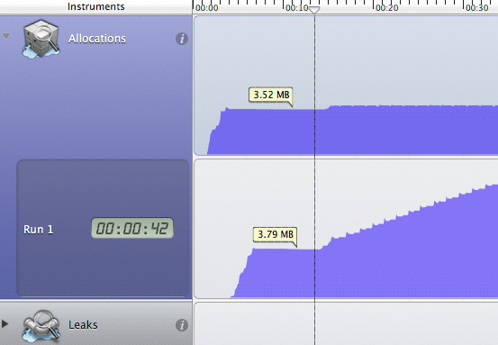
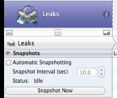



我早先在twitter上说过，ARC只是减少了手工管理内存的工作，不能消灭内存泄漏。随着block、GCD大量使用，内存泄漏会变得更隐秘。

提高应用质量，内存不可忽视。

一个真实的例子
----
我们有一个上线应用，提交后没事就想测测性能这块，我知道肯定会有内存泄漏（开发过程中根本没考虑这事），感兴趣的是会有多严重。

测试方法很简单，就是反复在两个重要的界面间切换，测试的结果比较“震撼”：每次切换大概可以泄漏不到10MB内存，不到10分钟就耗光了600MB内存挂掉了！

然后我花了两个晚上查找修补了几个的泄漏点，前后对比如下：

泄漏的原因
----
* 循环引用，这是大部分泄漏的情况
* 

如何察觉泄漏的发生
----
ARC时代，Instruments的Leaks基本废掉了，常用的Foundation对象不会因为release不当出问题，大部分泄漏是循环引用导致的

hong已经越狱了的话，可以装一个SBSettings，它可以在状态栏显示当前还有多少可用内存。

定位泄漏点
----
### Tips: 禁用Lesks的自动快照

如果应用一上来使用了很多内存（譬如上百MB），Instruments可能跑了几秒钟就显示断开设备了，这时就需要禁用掉Lesks的自动快照。

*
*

经验总结
----
* 注意block中的引用
* 能用weak，就别用strong
* hong上调试、使用，注意旧设备上的表现。比如在iPad 4上微微感觉有些延迟，在iPad 1上的表现可能是无法容忍（遇到过完全卡死的情况）
* 使用autorelease pool。比如，大循环中使用降低峰值内存，区域性清理大量自动释放对象
* 利用模拟器模拟内存警告，结合Instruments测试内存警告代码有效性
* 在`viewDidUnload`中释放能被`viewDidLoad`重建的资源

